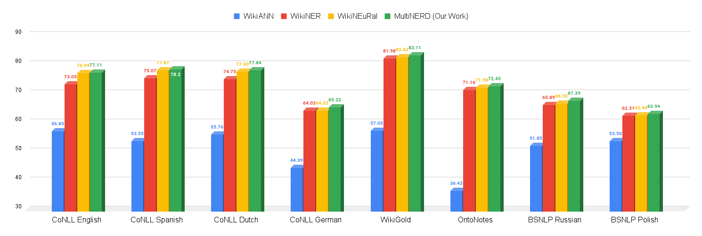

# MultiNERD
--------------------------------------------------------------------------------

Data and evaluation code for the paper [MultiNERD: A Multilingual, Multi-Genre and Fine-Grained Dataset for Named Entity Recognition (and Disambiguation)]().

```bibtex
@inproceedings{tedeschi-etal-2022-multinerd,
    title = "{W}iki{NE}u{R}al: {C}ombined Neural and Knowledge-based Silver Data Creation for Multilingual {NER}",
    author = "Tedeschi, Simone  and
      Maiorca, Valentino  and
      Campolungo, Niccol{\`o}  and
      Cecconi, Francesco  and
      Navigli, Roberto",
    booktitle = "Findings of the Association for Computational Linguistics: EMNLP 2021",
    month = nov,
    year = "2021",
    address = "Punta Cana, Dominican Republic",
    publisher = "Association for Computational Linguistics",
    url = "https://aclanthology.org/2021.findings-emnlp.215",
    pages = "2521--2533",
    abstract = "Multilingual Named Entity Recognition (NER) is a key intermediate task which is needed in many areas of NLP. In this paper, we address the well-known issue of data scarcity in NER, especially relevant when moving to a multilingual scenario, and go beyond current approaches to the creation of multilingual silver data for the task. We exploit the texts of Wikipedia and introduce a new methodology based on the effective combination of knowledge-based approaches and neural models, together with a novel domain adaptation technique, to produce high-quality training corpora for NER. We evaluate our datasets extensively on standard benchmarks for NER, yielding substantial improvements up to 6 span-based F1-score points over previous state-of-the-art systems for data creation.",
}
```

**Please consider citing our work if you use data and/or code from this repository.**

In a nutshell, MultiNERD is the first **language-agnostic** methodology for automatically creating **multilingual, multi-genre and fine-grained annotations** for **Named Entity Recognition** and **Entity Disambiguation**. Specifically, it can be seen an extension of the combination of two prior works from our research group that are [WikiNEuRal](https://www.github.com/Babelscape/wikineural), from which we took inspiration for the state-of-the-art silver-data creation methodology, and [NER4EL](https://www.github.com/Babelscape/NER4EL), from which we took the fine-grained classes and inspiration for the entity linking part. 

The produced dataset covers:
- **10 languages**: Chinese, Dutch, English, French, German, Italian, Polish, Portuguese, Russian and Spanish;
- **15 NER categories**: Person (PER), Location (LOC), Organization (ORG}), Animal (ANIM), Biological entity (BIO), Celestial Body (CEL), Disease (DIS), Event (EVE), Food (FOOD), Instrument (INST), Media (MEDIA), Plant (PLANT), Mythological entity (MYTH), Time (TIME) and Vehicle (VEHI);
- **2 textual genres**, i.e. [Wikipedia](https://www.wikipedia.org/) and [WikiNews](https://www.wikinews.org/) articles;
- **3 different reference KBs for entity disambiguation**, i.e. [BabelNet](https://babelnet.org/), [WikiData](https://www.wikidata.org) and [Wikipedia](https://www.wikipedia.org/). 

Additionally, we included image URLs to encourage the creation of **multimodal** systems.

Finally, MultiNERD shows consistent improvements of up to **against state-of-the-art alternative** data production methods on common benchmarks for NER while covering a broader set of NER categories (15 vs. 4):



<br>

# Data

| Dataset Version | Sentences | Tokens | PER | ORG | LOC | ANIM | BIO | CEL | DIS | EVE | FOOD | INST | MEDIA | MYTH | PLANT | TIME | VEHI | O | OTHER |
| :------------- | -------------: | -------------: | -------------: | -------------: | -------------: | -------------: | -------------: | -------------: | -------------: | -------------: | -------------: | -------------: | -------------: | -------------: | -------------: | -------------: | -------------: | -------------: | -------------: |
| [MultiNERD EN](data/wikineural/en/) | 116k | 2.73M | 51k | 31k | 67k | 45k | 2.40M |
| [MultiNERD ES](data/wikineural/es/) | 95k | 2.33M | 43k | 17k | 68k | 25k | 2.04M |
| [MultiNERD NL](data/wikineural/nl/) | 107k | 1.91M | 46k | 22k | 61k | 24k | 1.64M |
| [MultiNERD DE](data/wikineural/de/) | 124k | 2.19M | 60k | 32k | 59k | 25k | 1.87M |
| [MultiNERD RU](data/wikineural/ru/) | 123k | 2.39M | 40k | 26k | 89k | 25k | 2.13M |
| [MultiNERD IT](data/wikineural/it/) | 111k | 2.99M | 67k | 22k | 97k | 26k | 2.62M |
| [MultiNERD FR](data/wikineural/fr/) | 127k | 3.24M | 76k | 25k | 101k | 29k | 2.83M |
| [MultiNERD PL](data/wikineural/pl/) | 141k | 2.29M | 59k | 34k | 118k | 22k | 1.91M |
| [MultiNERD PT](data/wikineural/pt/) | 106k | 2.53M | 44k | 17k | 112k | 25k | 2.20M |
| [MultiNERD ZH](data/wikineural/pt/) | 106k | 2.53M | 44k | 17k | 112k | 25k | 2.20M |


We remark that the datasets are automatically created, and, therefore, they may contain errors. 

<br>


# License 
MultiNERD is licensed under the CC BY-SA-NC 4.0 license. The text of the license can be found [here](./LICENSE).

We underline that the source from which the raw sentences have been extracted are Wikipedia ([wikipedia.org](https://www.wikipedia.org/)) and Wikinews [wikinews.org](https://www.wikinews.org/) and the NER annotations have been produced by [Babelscape](https://babelscape.com/).

<br>

# Acknowledgments
We gratefully acknowledge the support of the **ERC Consolidator Grant MOUSSE No. 726487** under the European Union’s Horizon2020 research and innovation programme ([http://mousse-project.org/](http://mousse-project.org/)).